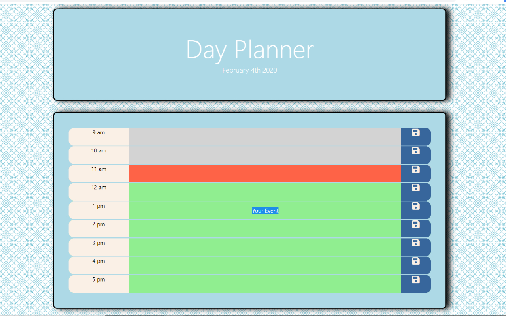

# Day Planner

A simple to use scheduling tool

## Instructions

* Simply click inside the disired field, next to the desired time slot and type away. 

* Save any changes by clicking on the save button and you are all set. 

  * Note that any event highlighted in grey is in present time. If an item is highlighted in green it is set to future time and anything highlighted in red is set to past time.

  
